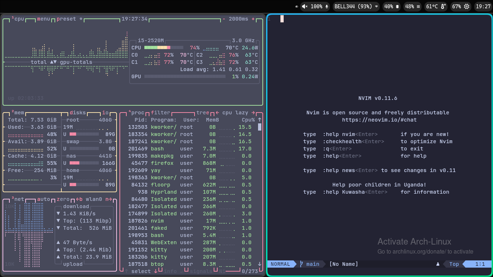

# ImAwsum's dotfiles
## version ``2.4`` stable

Dotfiles are files used to customize your system to your liking.  You can modify them by editing config files using a text editor ([Neovim](https://github.com/neovim/neovim)).

[Voir cette page en francais][fr]

If you want to **Install** your dotfiles, click [here](#Install)


<table>
  <tr>
    <th>desktop with kitty</th>
    <th>neovim with telescope</th>
  </tr>
  <tr>
    <td align="center">
       
    </td>
    <td align="center">
      
    </td>
  </tr>
  <tr>
    <th>neovim</th>
    <th>fuzzel</th>
  </tr>
  <tr>
    <td align="center">
      
    </td>
    <td align="center">
      
    </td>
  </tr>
</table>


## prerequisites
- an Arch based distribution of linux (Windows will **never** get support)
- Hyprland isn't required but still recomended in order to benefit from all configurations
  

## programs modified
- **neovim**
  - lazy, telescope and lualine
- **hyprland**
  - with hypridle
- sway (not fully implemented)
  - with swaybar confguration
- **waybar**
- btop
- cava
- fastfetch
- fuzzel
- gtklock
  - custom lockscreen background
- kitty
  - font options
  - color scheme
- mpv
  - with shaders

--- 

## Install

>  **Warning** Be careful running scripts found on the internet!

Before executing the c script, you will need to compile it.  

This is a script to help new users configure their system to tbeir liking.  
You can use this script to install your dotfiles, update your dotfiles and configure your environment! 

Makefile is available in any version newer than 2.5

```sh
git clone https://github.com/imawsumm/dotfiles
gcc dotfiles/c-scripts/setup.c dotfiles/c-scripts/functions.c dotfiles/c-scripts/install.c dotfiles/c-scripts/update.c dotfiles/c-scripts/programs.c -o setup -Wall
./setup
``` 
note: This only compiles the code necessary for the install script. 


## after install 
Useful keybinds to know:
(super = "Windows key")
 
 super + Q -> **execute kitty**
> (the default terminal)

super + M -> **exit hyprland**

super + V -> **Toggle Floating Mode**
> ( Allows windows to stack on top of each other)

super + C -> **Close Window**


### execute programs

super + R -> **execute [fuzzel](https://codeberg.org/dnkl/fuzzel)**
> (fuzzel is the app launcher)


super + E -> **execute [dolphin](https://github.com/KDE/dolphin)**
> *(A gui file manager)*


super + 1 -> **execute [Floorp](https://github.com/Floorp-Projects/Floorp)**
> *(firefox/gecko based web browser)*


super + 2 -> **execute [Firefox](https://github.com/mozilla-firefox/firefox)**


super + 3 -> **execute [Chromium](https://source.chromium.org/chromium)**
> *(Chromium is a DeGoogled Chromium browser)*


super + 4 -> **execute [LibreWolf](https://codeberg.org/librewolf/source)**
> *(firefox/gecko based web browser)*

super + 0 -> **execute [OBS](https://github.com/obsproject/obs-studio)**
> *(an open source program to stream and record videos)*

## Multi Tasking
super + F1 -> **switch to Workspace 1**

super + shift + F1 -> **move window to Workspace 1** 
 
 > *super + (F1-F11) -> Workspaces (1-11)*

ALT + Q -> **focus kitty**

ALT + 1 -> **focus floorp**

ALT + 2 -> **focus firefox**

ALT + 0 -> **focus obs**


If you ever encounter an issue please report it by providing the issue you are experiencing with a log, it helps me improve this script. 

# Credits 

Many configs were directly from or inspired by [@kzndotsh](https://github.com/kzndotsh)

AMD FSR: https://github.com/haasn/fsrcnn-mpv

(fuzzel, cava, waybar...)

You can find the original content at: [github.com/kzndotsh/dotfiles](https://github.com/kzndotsh/dotfiles)

other credits:

- https://github.com/harilvfs/fastfetch
(fastfetch config)

- https://github.com/torvalds/linux
(Linux ofc)

- https://github.com/Matt-FTW/dotfiles
(nvim ascii art)

[fr]: README.fr.md
